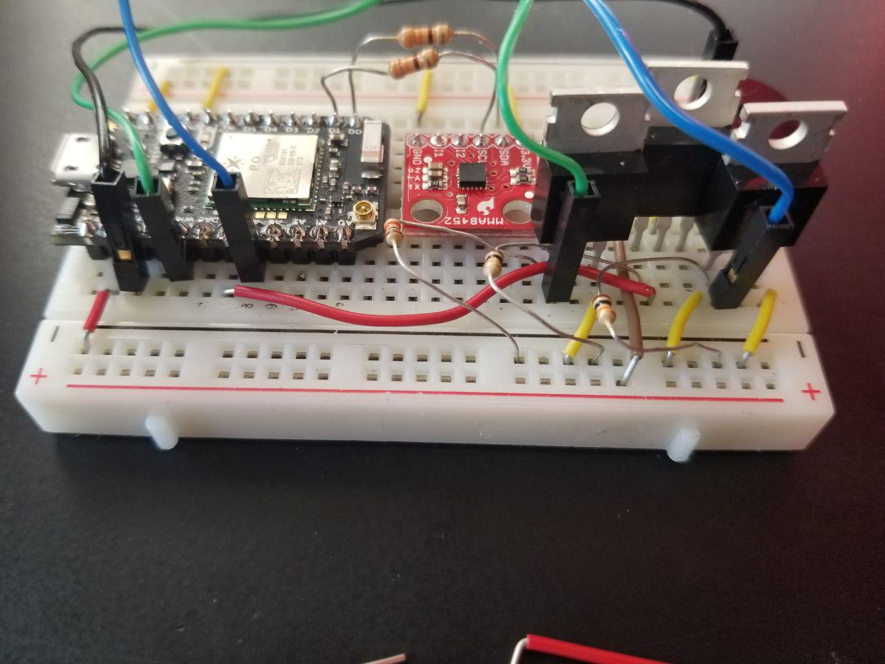
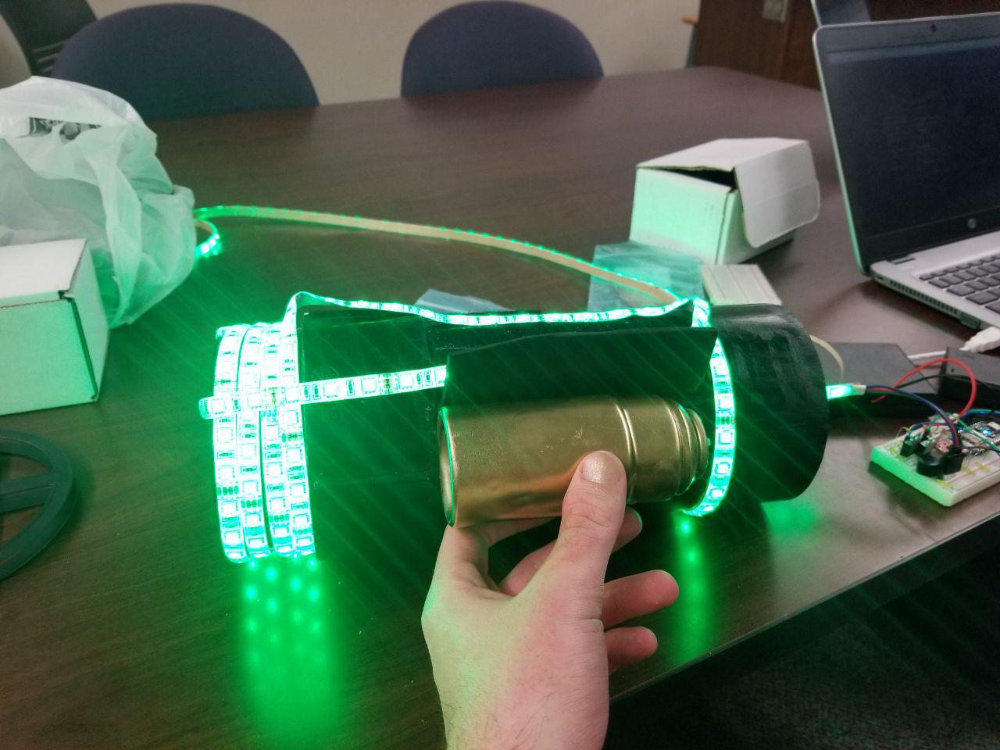
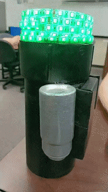

# Photon Blaster!
-----

## List of Components
* 1 x Photon
* 12v RGB LED strip (SMD5050)
* 3 x 10k Ohm Resistors
* 3 x Logic Level N-channel MOSFETs
* 1 x Breadboard
* Hookup wires
* 12v Power Supply - 8xAA Battery Pack
* 4.5v Power Supply - 3xAA Battery Pack
* Sparkfun MMA8452Q Accelerometer
* PBC Pipe (The Blaster Body)

## Schematics

### LEDs

Here's our basic schematic of the SMD5050.

Schematic of MMA8452Q Accelerometer

## Functionalities

### States
The blaster itself runs differently depending on the state that it is in. States are changed due accelerometer detected position changes. In this implementation, the 3 main states are:

* Inactive
  - Breathes red slowly. Does nothing.

* Idle
  - Ability to shoot. Breathes normally.

* Receiving
  - Receives IoT Functionalities such as changing the fade color during idle mode, rainbow, and strobe.

## Progress

### Initial Setup

#### Here we have our Photon Device, LEDs, and the Gauntlet prototype itself.

#### First iteration:

#### Second iteration:

#### It works!
 

#### Finalized Circuit

#### Finalized Blaster

