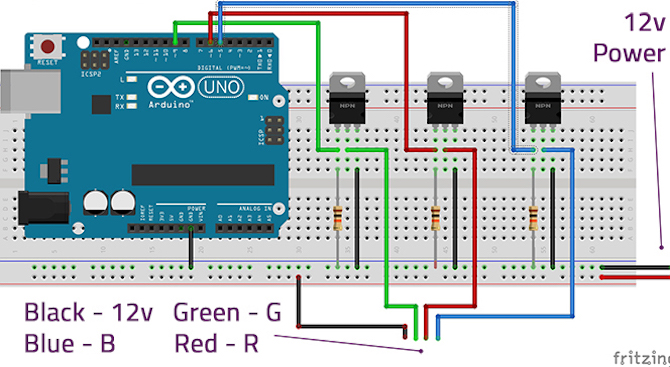
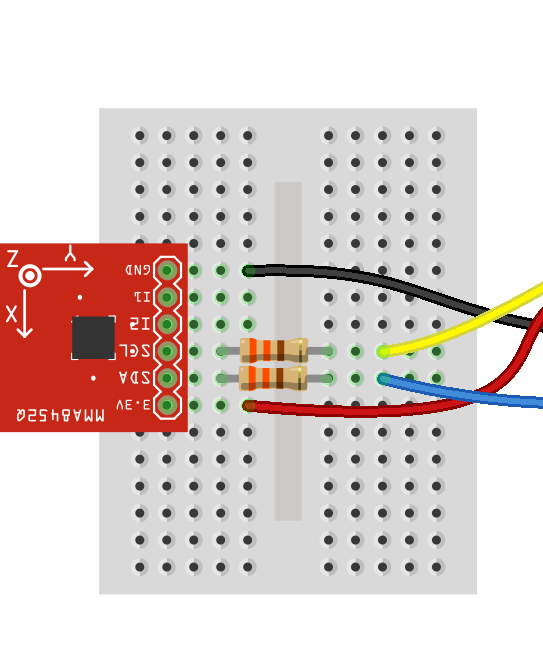
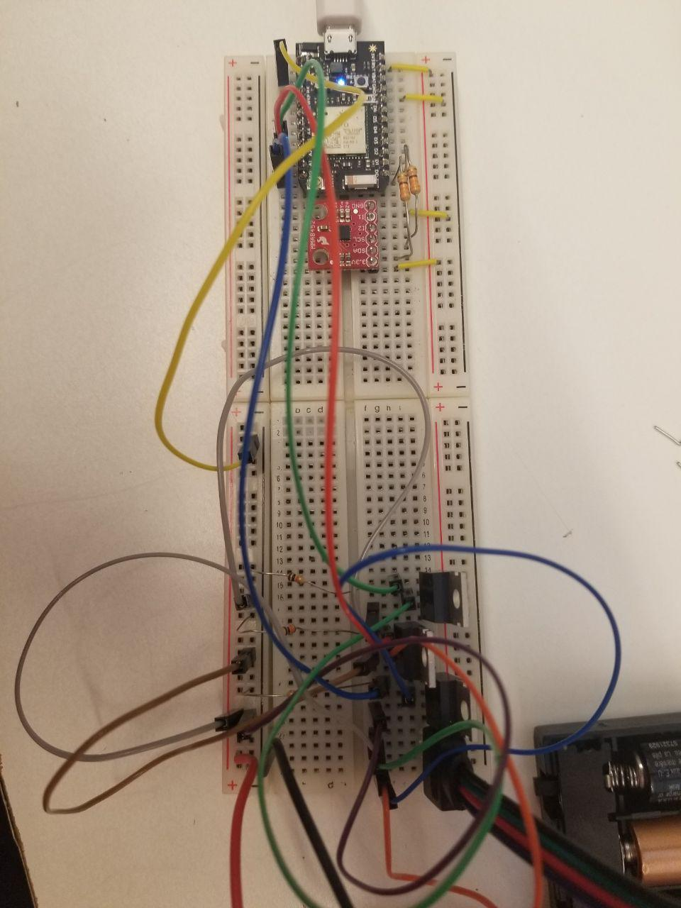
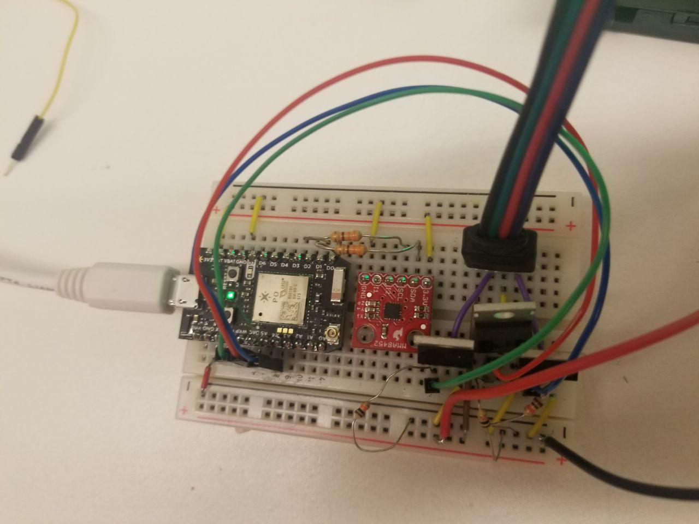
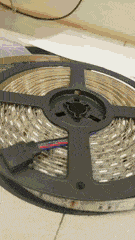
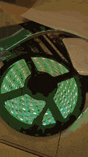

# Photon Blaster!
-----

## List of Components
* 1 x Photon
* 12v RGB LED strip (SMD5050)
* 3 x 10k Ohm Resistors
* 3 x Logic Level N-channel MOSFETs
* 1 x Breadboard
* Hookup wires
* 12v Power Supply - 8xAA Battery Pack
* 4.5v Power Supply - 3xAA Battery Pack
* Sparkfun MMA8452Q Accelerometer

## Schematics

### LEDs

Here's our basic schematic of the SMD5050.

Schematic of MMA8452Q Accelerometer

## Progress

### Initial Setup

Here we have our Photon Device, LEDs, and the Guantlet prototype itself.

First iteration:

Second iteration:

It works!
 
